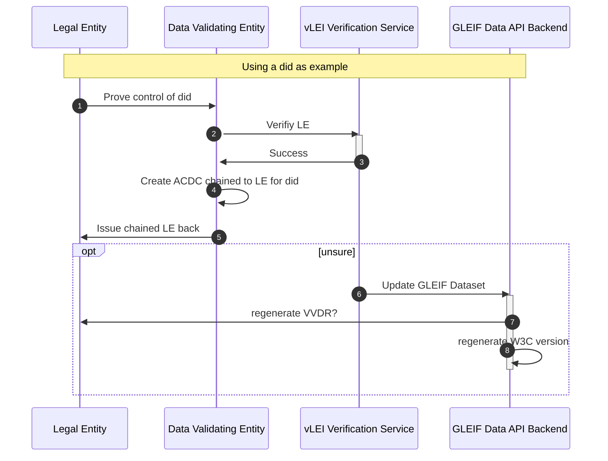

```mermaid
sequenceDiagram
autonumber

participant LE as Legal Entity
participant D as Data Validating Entity
participant V as vLEI Verification Service
participant G as GLEIF Data API Backend
Note over LE,G: Using a did as example
LE->>D: Prove control of did
activate D
D->>V: Verifiy LE
activate V
V->>D: Success
deactivate V
D->>D: Create ACDC chained to LE for did
D->>LE: Issue chained LE back
opt unsure
V->>G: Update GLEIF Dataset
activate G
G->>LE: regenerate VVDR?
G->>G: regenerate W3C version
deactivate G
end

```