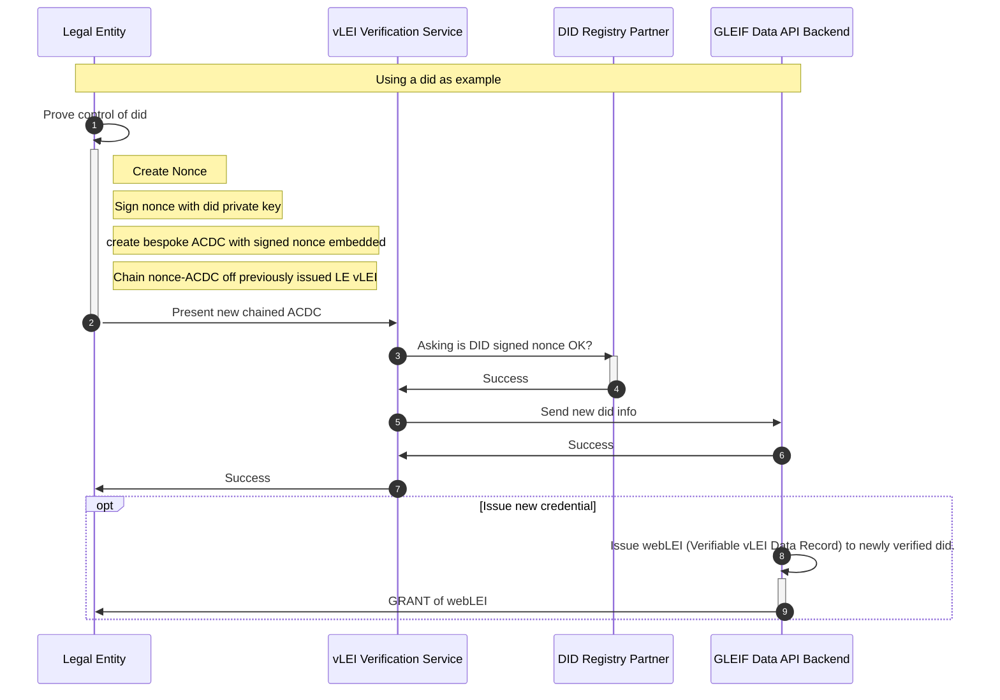

```mermaid
sequenceDiagram
autonumber

participant LE as Legal Entity
participant V as vLEI Verification Service
participant D as DID Registry Partner
participant G as GLEIF Data API Backend
Note over LE,G: Using a did as example

LE->>LE: Prove control of did
activate LE
Note right of LE: Create Nonce
Note right of LE: Sign nonce with did private key
Note right of LE: create bespoke ACDC with signed nonce embedded
Note right of LE: Chain nonce-ACDC off previously issued LE vLEI
LE->>V: Present new chained ACDC
deactivate LE

V->>D: Asking is DID signed nonce OK?
activate D
D->>V: Success
deactivate D

V->>G: Send new did info
G->>V: Success
V->>LE: Success

opt Issue new credential
G->>G:  Issue webLEI (Verifiable vLEI Data Record) to newly verified did.
activate G
G->>LE: GRANT of webLEI
deactivate G
end
```
