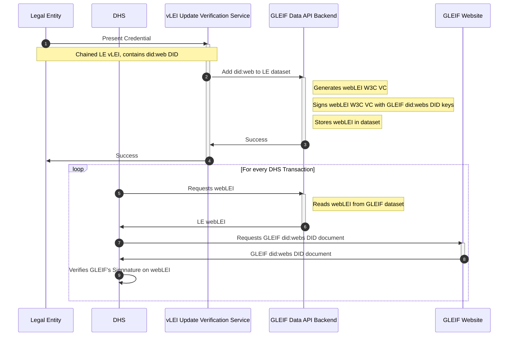

```mermaid
sequenceDiagram
autonumber

participant LE as Legal Entity
participant D as DHS
participant V as vLEI Update Verification Service
participant G as GLEIF Data API Backend
participant W as GLEIF Website

LE->>V: Present Credential
activate V
Note over LE,V: Chained LE vLEI, contains did:web DID
V->>G: Add did:web to LE dataset
activate G
Note right of G: Generates webLEI W3C VC
Note right of G: Signs webLEI W3C VC with GLEIF did:webs DID keys
Note right of G: Stores webLEI in dataset
G->>V: Success
deactivate G
V->>LE: Success
deactivate V
loop For every DHS Transaction
    D->>G: Requests webLEI
    activate G
    Note right of G: Reads webLEI from GLEIF dataset
    G->>D: LE webLEI
    deactivate G
    D->>W: Requests GLEIF did:webs DID document
    activate W
    W->>D: GLEIF did:webs DID document
    deactivate W
    D->>D: Verifies GLEIF's Signnature on webLEI
end
```
