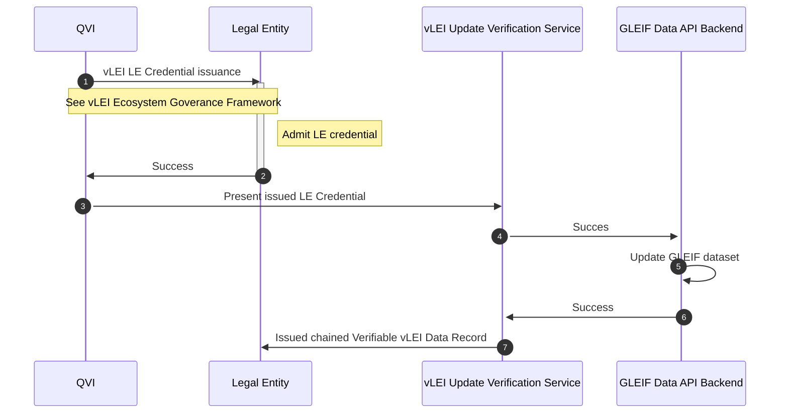

```mermaid
sequenceDiagram
autonumber

participant Q as QVI
participant LE as Legal Entity
participant V as vLEI Update Verification Service
participant G as GLEIF Data API Backend

Q->>LE: vLEI LE Credential issuance
activate LE
Note over Q,LE: See vLEI Ecosystem Goverance Framework
Note Right of LE: Admit LE credential
LE->>Q: Success
deactivate LE
activate Q
Q->>V: Present issued LE Credential
activate V
activate G
V->>G: Succes
G->>G: Update GLEIF dataset
G->>V: Success
V->>LE: Issued chained Verifiable vLEI Data Record
```
