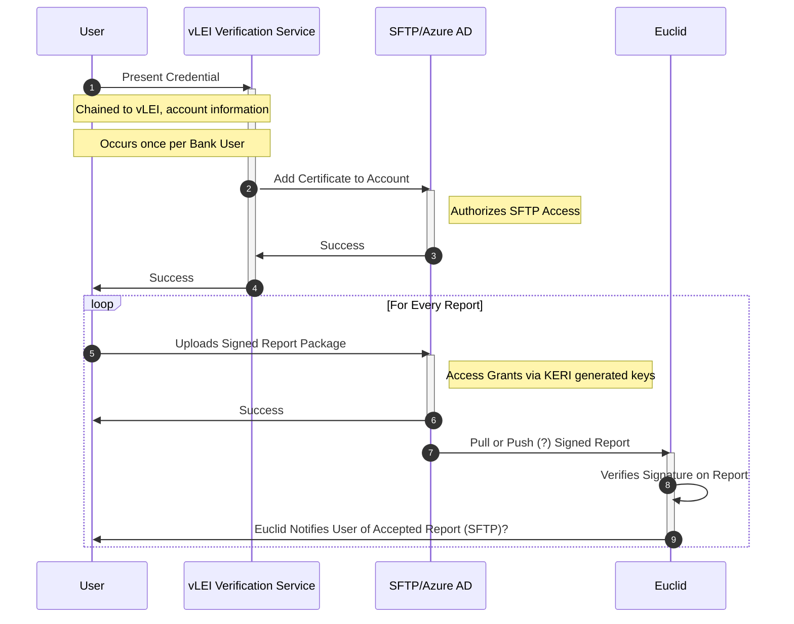

```mermaid
sequenceDiagram
autoNumber

participant U as User
participant V as vLEI Verification Service
participant S as SFTP/Azure AD
participant E as Euclid

U->>V: Present Credential
activate V
Note over U,V: Chained to vLEI, account information
Note over U,V: Occurs once per Bank User
V->>S: Add Certificate to Account
activate S
Note right of S: Authorizes SFTP Access
S->>V: Success
deactivate S
V->>U: Success
deactivate V
loop For Every Report
    U->>S: Uploads Signed Report Package
    activate S
    Note right of S: Access Grants via KERI generated keys
    S->>U: Success
    deactivate S
    S->>E: Pull or Push (?) Signed Report
    activate E
    E->>E: Verifies Signature on Report
    E->>U: Euclid Notifies User of Accepted  Report (SFTP)?
    deactivate E
end
```
