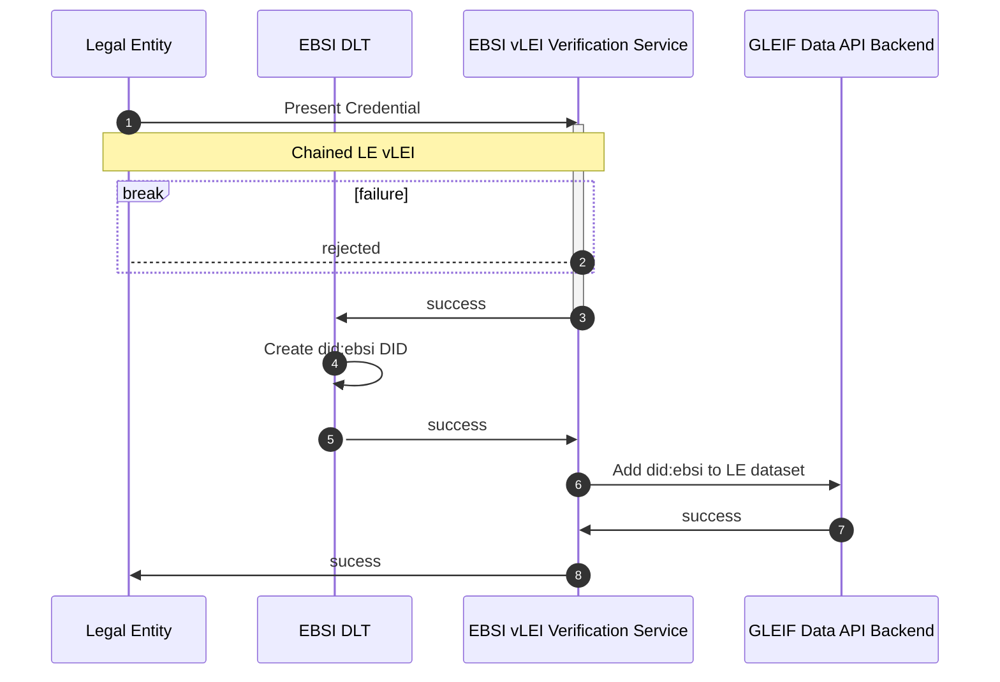

```mermaid

sequenceDiagram
autonumber
participant LE as Legal Entity
participant EBSI-D as EBSI DLT
participant EBSI-V as EBSI vLEI Verification Service
links EBSI-V: {"Verifier": "https://github.com/GLEIF-IT/reg-poc-verifier/"}
participant G as GLEIF Data API Backend

LE->>EBSI-V: Present Credential
activate EBSI-V
Note over LE,EBSI-V: Chained LE vLEI
break failure
    EBSI-V-->LE: rejected
end
EBSI-V->>EBSI-D: success
deactivate EBSI-V
EBSI-D->>EBSI-D: Create did:ebsi DID
activate EBSI-D
EBSI-D->>EBSI-V: success
activate EBSI-D
EBSI-V->>G: Add did:ebsi to LE dataset
G->>EBSI-V: success
EBSI-V->>LE: sucess
```
