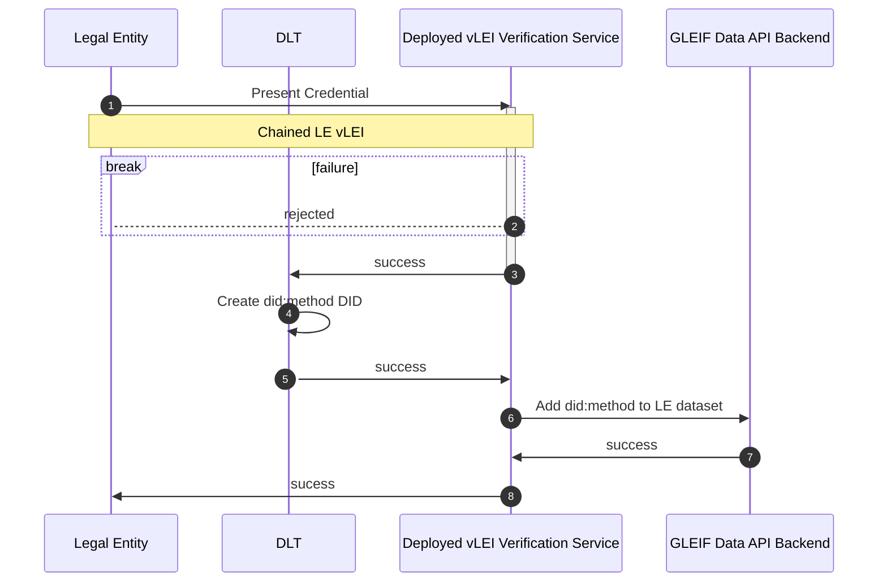

```mermaid

sequenceDiagram
autonumber
participant LE as Legal Entity
participant D as DLT
participant V as Deployed vLEI Verification Service
links V: {"Verifier": "https://github.com/GLEIF-IT/reg-poc-verifier/"}
participant G as GLEIF Data API Backend

LE->>V: Present Credential
activate V
Note over LE,V: Chained LE vLEI
break failure
    V-->LE: rejected
end
V->>D: success
deactivate V
D->>D: Create did:method DID
activate D
D->>V: success
activate D
V->>G: Add did:method to LE dataset
G->>V: success
V->>LE: sucess
```
